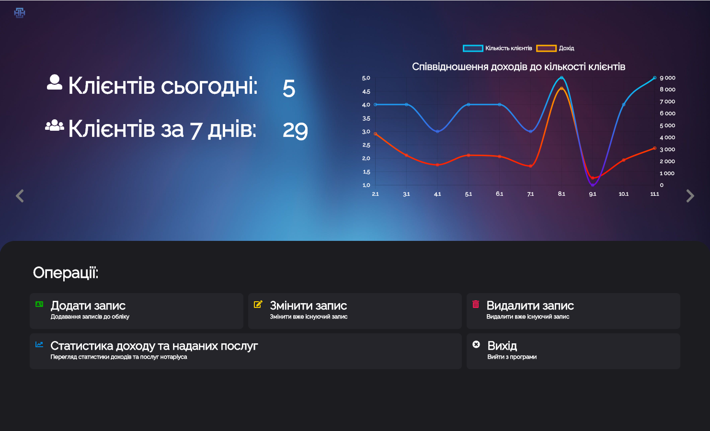
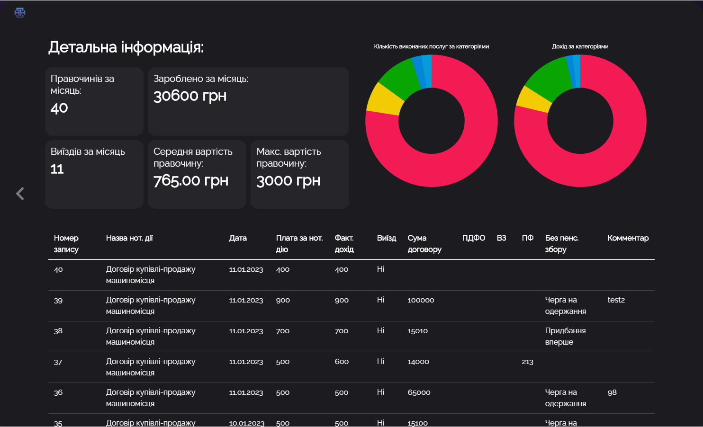
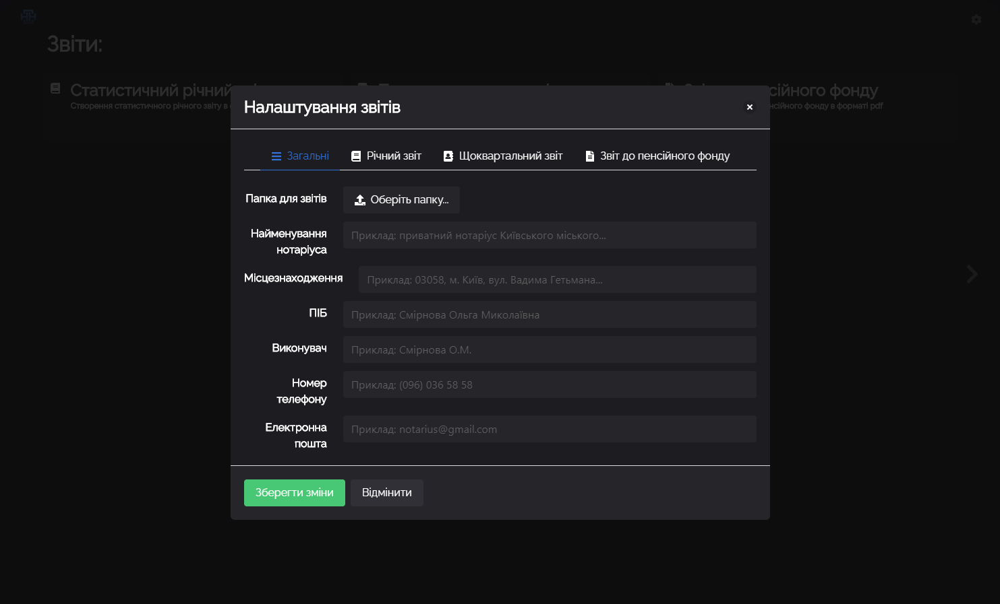

<div id="top"></div>

# NotaryTrackProg
This program is designed to provide efficient and secure management of notary affairs. It allows users to create and manage notarial documents, manage clients and their records, and securely store and access all related data. The program also provides a secure online platform for clients to access their documents and other information. It also provides full access of all activities related to the notary affairs for free. The program is designed to ensure the highest level of accuracy for all notarial activities and will help notaries analyse statistics and make reports about their income.

## Images
### Main Tab

### Statistics Tab

### Reports Tab


### Programming language, libraries and frameworks: 
* JavaScript
* [Electron](https://www.electronjs.org/)
* [Node adodb](https://github.com/nuintun/node-adodb)
* [HummusJS](https://github.com/galkahana/HummusJS)

### What this program can do:
1. Working with database records
   * Add a new record
   * Change record
   * Delete record
2. Showing statistics like
   * Show clients for the last (day/week/months)
   * View daily statistics on the chart
   * Show income for the last month
   * Show mean income from record
   * Show amount of records made outside the office
   * Show last 10 records
3. Make income reports
   * Year report by all categories
   * Quarter report by deals with real estate
   * Report to pension fund for the last quarter
* More features coming soon...

### Advantages:
* Open source that allows you to customize the application to fit your needs
* No internet access needed
* Ability to explore and manage complete statistics thanks to various charts and built-in databases
* Stylish minimalist design that makes it easy to use the application
* Free access to the full functionality of the application

### How to use
1. Clone the repository to local storage.
```sh
git clone https://github.com/Artic67/NotaryTrackProg.git
```
2. Installing NPM modules:
```sh
npm i
```
3. To run the program use:
```sh
npm run start
```
4. To compile the program and create an installation file, use:
```sh
npm run make
```

### Installing advices
1. Install Microsoft Access Database Engine 32 bit: [link](https://www.microsoft.com/en-us/download/confirmation.aspx?id=13255 "MADE 32 bit").
2. For better compatibility use [NodeJS 14.17.0 with npm 6.14.13](https://nodejs.org/download/release/v14.17.0/ "NodeJS 14.17.0").

### Road map
- [x] Create the main page of the application
- [x] Add a page with additional information
- [x] Add the ability to add a new record to the database
- [x] Add the ability to change and delete records in the database
- [x] Add a page with making income reports
- [x] Add settings tab for every income report
- [x] Add a page with charts and statistics
- [x] Translate all content to Ukrainian language
- [x] Add more icons and block to make design more enjoyable
- [ ] Make functionality to scroll or chose pages with records on change record tab and statistics tab
- [ ] Add functionslity to check expances and costs
- [ ] Include expances and costs to statictics
- [ ] Take into consideration expances and costs in reports

You can also write us your requests for this application on the page [Suggestions and issues](https://github.com/Artic67/NotaryTrackProg/issues)

<p align="right">(<a href="#top">up</a>)</p>
